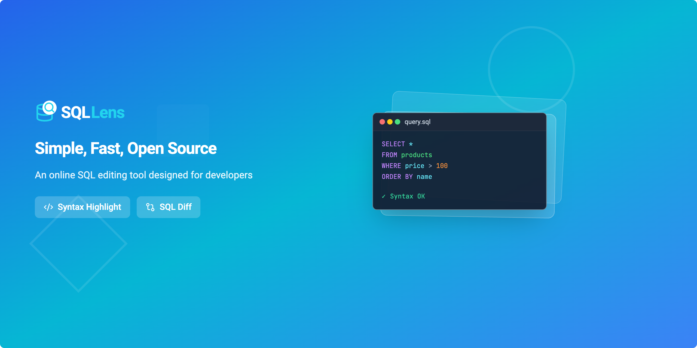

<div align="center">
  
  
  <h1>SQL Lens</h1>
  
  <p>
    <strong>A Modern, Aesthetic SQL Editor & Diff Tool</strong>
  </p>
  
  <p>
    <a href="#-features">Features</a> •
    <a href="#-tech-stack">Tech Stack</a> •
    <a href="#-getting-started">Getting Started</a> •
    <a href="./READNE.zh-CN.md">中文 🇨🇳</a>
  </p>
</div>

---

## ✨ Introduction

**SQL Lens** is a lightweight, browser-based SQL editor designed for developers who care about aesthetics and efficiency. It provides a modern interface for writing, formatting, and comparing SQL queries with support for multiple dialects.

Unlike traditional clunky SQL tools, SQL Lens focuses on a clean user experience with features like intelligent diff visualization, real-time syntax validation, and a beautiful UI that adapts to your system's theme.

## 🚀 Features

- **💎 Modern UI/UX**: Clean, minimalist interface with Glassmorphism effects and smooth transitions.
- **🌗 Theming**: Native support for "One Light" and "One Dark" color schemes with automatic system detection.
- **📝 Multi-Dialect Support**: Syntax highlighting and validation for **Standard SQL**, **MySQL**, **PostgreSQL**, and **Spark SQL**.
- **⚖️ SQL Diff**: Intelligent comparison between two SQL snippets to visualize changes (Insertions/Deletions).
- **⚡ Real-time Validation**: Instant syntax error checking and feedback as you type.
- **🎨 Code Formatting**: One-click SQL formatting to keep your queries neat and readable.
- **🖼️ Banner Generator**: Built-in tool to generate beautiful social media banners for your code snippets.

## 🛠 Tech Stack

- **Frontend Framework**: [React 18](https://reactjs.org/)
- **Build Tool**: [Vite](https://vitejs.dev/)
- **Styling**: [Tailwind CSS](https://tailwindcss.com/)
- **Editor Core**: [CodeMirror 6](https://codemirror.net/)
- **Icons**: [Lucide React](https://lucide.dev/)
- **Utilities**: `sql-formatter`, `dt-sql-parser`

## 🏁 Getting Started

### Prerequisites

- Node.js (v16 or higher)
- npm or yarn

### Installation

1. Clone the repository:
   ```bash
   git clone https://github.com/yourusername/sql-lens.git
   cd sql-lens
   ```

2. Install dependencies:
   ```bash
   npm install
   ```

3. Start the development server:
   ```bash
   npm run dev
   ```

4. Open your browser and navigate to `http://localhost:5173` (or the port shown in your terminal).