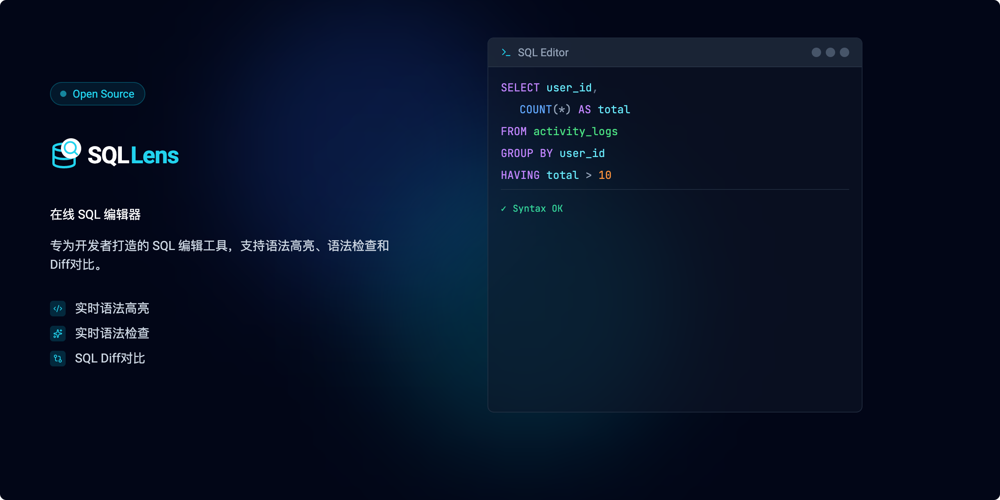

<div id="chinese" align="center">
 
  <h1>SQL Lens</h1>
  
  <p>
    <strong>现代、美观的 SQL 编辑与对比工具</strong>
  </p>
  <p>
    <a href="#-功能特性">Features</a> •
    <a href="#-技术栈">Tech Stack</a> •
    <a href="#-快速开始">Getting Started</a>
  </p>
</div>

## ✨ 简介

**SQL Lens** 是一款专为开发者打造的轻量级在线 SQL 编辑器。它拥有现代化的界面设计，旨在提供流畅的 SQL 编写、格式化及对比体验。

区别于传统臃肿的数据库工具，SQL Lens 专注于极致的用户体验，提供智能的差异可视化、实时语法校验以及能够自适应系统主题的精美 UI。

## 🚀 功能特性

- **💎 现代 UI/UX**：极简主义设计，融合毛玻璃（Glassmorphism）效果与流畅的交互动画。
- **🌗 丰富主题**：内置 "One Light" 和 "One Dark" 颜色主题，支持跟随系统自动切换深色模式。
- **📝 多方言支持**：支持 **标准 SQL**、**MySQL**、**PostgreSQL** 和 **Spark SQL** 的语法高亮与校验。
- **⚖️ SQL 差异对比**：智能比对两段 SQL 代码，直观展示新增与删除的差异（Diff）。
- **⚡ 实时校验**：输入时即时检测语法错误并提供反馈。
- **🎨 代码格式化**：一键美化 SQL 代码，保持代码整洁可读。
- **🖼️ Banner 生成器**：内置工具，可为你的代码片段生成精美的社交媒体分享图片。

## 🛠 技术栈

- **前端框架**: [React 18](https://reactjs.org/)
- **构建工具**: [Vite](https://vitejs.dev/)
- **样式库**: [Tailwind CSS](https://tailwindcss.com/)
- **编辑器内核**: [CodeMirror 6](https://codemirror.net/)
- **图标库**: [Lucide React](https://lucide.dev/)
- **核心工具**: `sql-formatter`, `dt-sql-parser`

## 🏁 快速开始

### 环境要求

- Node.js (v16 或更高版本)
- npm 或 yarn

### 安装运行

1. 克隆仓库：
   ```bash
   git clone https://github.com/yourusername/sql-lens.git
   cd sql-lens
   ```

2. 安装依赖：
   ```bash
   npm install
   ```

3. 启动开发服务器：
   ```bash
   npm run dev
   ```

4. 在浏览器中访问 `http://localhost:5173` (或终端中显示的端口)。

---

<div align="center">
  <p>Maintained by <a href="https://github.com/islgl">islgl</a></p>
</div>
